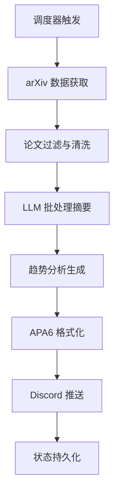
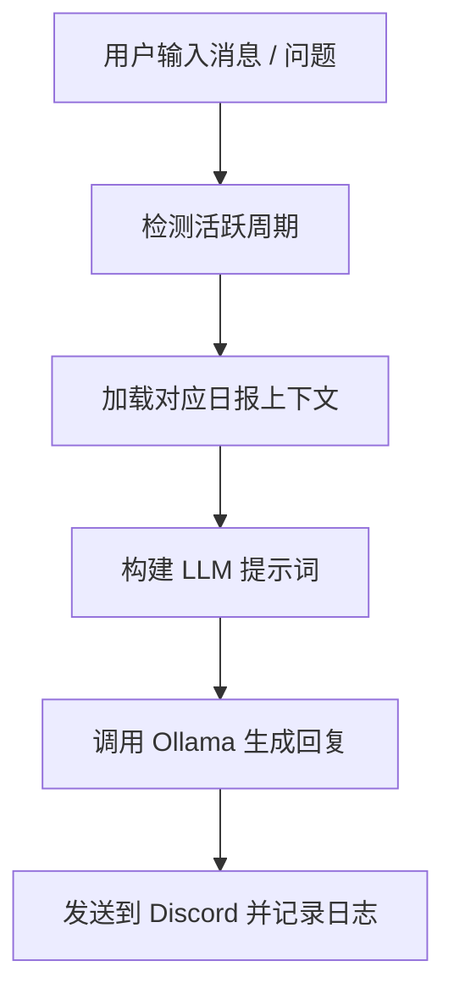

# arXivPush: 基于 Discord 的每日论文推送系统

<div align="center">

[](README.md)
[](README_EN.md)

</div>

<div align="center">
  <h3>自动化的科研信息系统，用于每日从 arXiv 获取最新论文并生成中英学术日报。
系统集成本地 LLM（Ollama）实现论文摘要趋势分析互动问答，通过 Discord 实时推送</h3>
</div>

---

**arXivPush** is an automated research information system that retrieves the latest papers from arXiv every day and generates bilingual (Chinese-English) academic daily reports.
 The system integrates a local LLM (Ollama) for paper summarization, trend analysis, and interactive Q&A, and pushes updates to Discord in real time.
 
## 部分输出示例

**ArxivPush** 系统自动生成的日报示例（由于消息过长，仅展示部分内容）。


## 快速部署指南

### 环境要求

  * Python 3.8+
  * Linux (原部署环境Ubuntu 24.04)
  * 内存 ≥ 4GB（推荐 8GB）
  * 硬盘空间 ≥ 10GB

### 外部依赖

* Ollama：本地大语言模型运行环境
* Discord Bot Token：从 Discord Developer Portal 获取
* Discord Channel ID：目标推送频道的唯一 ID


### 安装

#### 克隆与安装依赖

```
git clone <repository-url>
cd arxivpush
pip install -r requirements.txt
```

#### 安装 Ollama 并拉取模型

```
curl -fsSL https://ollama.ai/install.sh | sh
ollama pull qwen2.5:7b
ollama serve
```

> 16GB 显存推荐使用 `qwen2.5:7b`，8GB 可使用 `qwen2.5:3b`。

#### 配置 Discord 应用

1. 打开 [Discord Developer Portal](https://discord.com/developers/applications)
2. 创建应用 → 启用 Bot → 获取 Token
3. 启用 “Message Content Intent”
4. 邀请 Bot 至服务器
5. 获取频道 ID（右键频道 → Copy ID）

#### 创建 `.env`

```
DISCORD_BOT_TOKEN=your_discord_bot_token_here
```

#### 配置 `config.yaml`

```
queries:
- any:
  - machine learning
  - deep learning
- all:
  - transformer
  - attention
categories:
- cs.CV
- cs.LG
timezone: America/New_York
report_times:
- '10:00'
- '22:00'
discord_channel_id: your_channel_id_here
ollama:
  model: qwen2.5:7b
  host: http://127.0.0.1:11434
  keep_alive: 0
```

#### 启动服务

```bash
python bot.py
# 或后台运行
nohup python3 bot.py > bot_output.log 2>&1 &
```


## 运行与使用

###  Discord 命令（部分需要手动启用）

| 命令                     | 说明                |
| ------------------------ | ------------------- |
| arxiv-smi                | 查看系统状态        |
| arxiv-rn am / pm         | 立即生成早报 / 晚报 |
| arxiv-p-start            | 启动服务            |
| arxiv-p-stop             | 停止服务            |
| arxiv-p-config get / set | 查看或修改配置      |
| arxiv-p-logs [行数]      | 查看日志            |
| arxiv-help               | 查看帮助            |

### CLI 命令

```
python arxiv-cli.py start     # 启动服务
python arxiv-cli.py rn pm     # 手动生成晚报
python arxiv-cli.py smi       # 查看实时监控
```

### 对话功能

直接在 Discord 频道中输入以 `/` 开头的消息即可与最新日报对话：

```
/这些论文的研究趋势是什么？
/解释第一篇论文的主要创新点
```


## 系统架构

```mermaid
graph TD
      %% Main Components
      CLI[arxiv-cli.py<br/>Command Line Interface] --> Core[Core System]
      Bot[bot.py<br/>Discord Bot] --> Core
      Config[config.yaml<br/>Configuration] --> Core

      %% Core Processing Pipeline
      Core --> Fetch[arxiv_fetch.py<br/>Paper Fetching Engine]
      Core --> State[state.py<br/>State Management]
      Core --> Utils[utils.py<br/>Time Utilities]

      %% Paper Fetching Algorithm
      Fetch --> BuildQuery[Query Builder<br/>build_query]
      BuildQuery --> |Categories + Keywords| Search[arxiv.Search<br/>API Client]

      %% Batch Processing Logic
      Search --> BatchLoop[Batch Processing Loop<br/>fetch_window]
      BatchLoop --> |Iteration 1-N| Dedup[Duplicate Detection<br/>base_id
  deduplication]
      Dedup --> Filter[Content Filtering<br/>exclude keywords]
      Filter --> Accumulate[Paper Accumulator<br/>unique_papers dict]

      %% Batch Algorithm Controls
      BatchLoop --> |Check Targets| TargetCheck{Need more papers?<br/>target: 20}
      TargetCheck --> |Yes| ExpandSearch[Expand Search<br/>need_more * 3 papers]
      TargetCheck --> |No| SortResults[Sort by Published Date]
      ExpandSearch --> BatchLoop
      SortResults --> Pack[pack_papers<br/>JSON formatting]

      %% AI Processing Pipeline
      Pack --> Summarizer[summarizer.py<br/>AI Summarization Engine]

      %% Batch AI Processing
      Summarizer --> BatchAI[Batch AI Processing<br/>4 papers per batch]
      BatchAI --> |Batch 1| Ollama1[Ollama API Call 1]
      BatchAI --> |Batch 2| Ollama2[Ollama API Call 2]
      BatchAI --> |Batch 3| Ollama API Call 3]
      BatchAI --> |Batch 4| Ollama API Call 4]
      BatchAI --> |Batch 5| Ollama API Call 5]

      %% AI Processing Results
      Ollama1 --> Clean1[Text Cleaning<br/>clean_text]
      Ollama2 --> Clean2[Text Cleaning]
      Ollama3 --> Clean3[Text Cleaning]
      Ollama4 --> Clean4[Text Cleaning]
      Ollama5 --> Clean5[Text Cleaning]

      %% Content Assembly
      Clean1 --> Assemble[Content Assembly]
      Clean2 --> Assemble
      Clean3 --> Assemble
      Clean4 --> Assemble
      Clean5 --> Assemble

      Assemble --> TrendGen[Trend Analysis Generation<br/>Second Ollama Call]
      TrendGen --> PostProcess[text_processor.py<br/>Post Processing]

      %% Post Processing Pipeline
      PostProcess --> Extract[Extract Papers from Text]
      Extract --> Merge[Merge with Original Data]
      Merge --> RemoveDups[Remove Duplicates]
      RemoveDups --> EnsureLinks[Ensure arXiv Links]
      EnsureLinks --> FormatOutput[Format Final Output]

      %% Storage System
      FormatOutput --> StateStorage[PeriodState Storage]
      StateStorage --> RawData[storage/YYYY-MM-DD_AM/PM/<br/>raw_papers.json]
      StateStorage --> Report[storage/YYYY-MM-DD_AM/PM/<br/>report_zh_en.md]
      StateStorage --> Prompt[storage/YYYY-MM-DD_AM/PM/<br/>prompt_context.txt]
      StateStorage --> Chat[storage/YYYY-MM-DD_AM/PM/<br/>chat/]

      %% Status Management
      Core --> Status[status.json<br/>Runtime Status]
      Status --> Tracking[Paper Tracking<br/>pushed_papers.json]

      %% Scheduling System
      Bot --> Scheduler[APScheduler<br/>Cron Scheduler]
      Scheduler --> |Daily Mode| DailyCron[CronTrigger<br/>10:00 & 18:00]
      Scheduler --> |Hourly Mode| HourlyCron[CronTrigger<br/>Every Hour]

      %% Discord Integration
      Bot --> DiscordAPI[Discord API]
      DailyCron --> DigestGen[post_digest<br/>Generate Report]
      HourlyCron --> DigestGen
      DigestGen --> DiscordChannel[Channel Messages]

      %% CLI Commands Flow
      CLI --> StartCmd[arxiv-start<br/>Start Service]
      CLI --> StopCmd[arxiv-stop<br/>Stop Service]
      CLI --> StatusCmd[arxiv-status<br/>Check Status]
      CLI --> ReportCmd[arxiv-report<br/>Manual Report]
      CLI --> RNCmd[arxiv-rn<br/>Run Now]

      %% Command Processing
      ReportCmd --> ManualGen[generate_report<br/>Manual Generation]
      RNCmd --> ManualGen
      ManualGen --> Fetch

      %% Error Handling
      BatchLoop --> |API Errors| ErrorHandle[Error Handler]
      ErrorHandle --> Retry{Retry Count < 3?}
      Retry --> |Yes| BatchLoop
      Retry --> |No| LogError[Log to status.json]

      %% System Monitoring
      Bot --> Monitor[System Monitoring]
      Monitor --> CPU[CPU Usage]
      Monitor --> Memory[Memory Usage]
      Monitor --> OllamaCheck[Ollama Status Check]
      Monitor --> SchedulerStatus[Scheduler Status]

      %% Configuration Flow
      Config --> Queries[Search Queries<br/>keywords & categories]
      Config --> Timing[Time Settings<br/>window & timezone]
      Config --> AIConfig[AI Settings<br/>model & host]
      Config --> DiscordConfig[Discord Settings<br/>channel & token]

      %% Data Flow Annotations
      classDef batchProcess fill:#e1f5fe,stroke:#01579b,stroke-width:2px
      classDef aiProcess fill:#f3e5f5,stroke:#4a148c,stroke-width:2px
      classDef storage fill:#e8f5e8,stroke:#1b5e20,stroke-width:2px
      classDef control fill:#fff3e0,stroke:#e65100,stroke-width:2px

      class BatchLoop,TargetCheck,ExpandSearch,Dedup,Filter,Accumulate batchProcess
      class BatchAI,Ollama1,Ollama2,Ollama3,Ollama4,Ollama5,TrendGen aiProcess
      class StateStorage,RawData,Report,Prompt,Chat,Status,Tracking storage
      class
  Scheduler,DailyCron,HourlyCron,CLI,StartCmd,StopCmd,StatusCmd,ReportCmd,RNCmd
  control

```

### 模块说明

* **bot.py**：主入口，负责消息监听、命令解析、任务调度
* **arxiv_fetch.py**：从 arXiv 拉取论文并过滤
* **summarizer.py**：调用 Ollama 模型生成摘要与趋势分析
* **text_processor.py**：格式化文本、生成 APA6 引用
* **state.py**：持久化管理，存储所有周期数据


## 算法与实现细节

### 调度算法

```python
def start_scheduler():
    if report_mode == "hourly":
        scheduler.add_job(post_digest, CronTrigger(minute=0))
    else:
        for t in report_times:
            hour, minute = map(int, t.split(":"))
            scheduler.add_job(post_digest, CronTrigger(hour=hour, minute=minute))
```

### 查询构建算法

```python
def build_query(queries, categories, exclude_keywords):
    parts = []
    for query in queries:
        if 'any' in query:
            parts.append(f"({' OR '.join(query['any'])})")
        if 'all' in query:
            parts.append(f"({' AND '.join(query['all'])})")
    if categories:
        cat = " OR ".join([f"cat:{c}" for c in categories])
        parts.append(f"({cat})")
    return " AND ".join(parts)
```

### 批处理摘要生成

```python
def run_ollama(cfg, period_label, since_str, now_str, items_json):
    for i in range(0, len(items_json), 4):
        batch = items_json[i:i+4]
        prompt = build_batch_prompt(batch, i+1)
        result = call_ollama(prompt, timeout=300)
        all_content += reconstruct_with_numbering(result, batch, i+1)
    trend = call_ollama(build_trend_prompt(all_content))
    return post_process_with_links(all_content, trend, items_json)
```

### 文本解析与APA6生成

```python
def generate_apa6_citation(paper, index):
    arxiv_id = paper['id'].split('v')[0]
    authors = ', '.join(paper['authors'][:3]) + (' et al' if len(paper['authors']) > 3 else '')
    title = paper['title']
    year = paper['published'][:4]
    link = f"https://arxiv.org/abs/{arxiv_id}"
    return f"[{index}] {authors} ({year}). {title}. arXiv ID: {arxiv_id}. {link}"
```


## 系统流程

### 1. 定时推送



### 智能对话




## 性能与优化

* **批处理机制**：防止 LLM 上下文溢出
* **内存控制**：`keep_alive=0` 自动释放显存
* **并行数据抓取**：异步请求 arXiv API
* **分段推送**：自动切分长消息，保证 Discord 可读性
* **缓存策略**：避免重复拉取与生成，提高执行效率


## 配置与扩展

* 支持多模型：`DeepSeek`、`Qwen`、`Mistral`
* 支持自定义关键词逻辑（AND / OR 混合）
* 支持多时区与多周期
* 报告模板可定制（精简版、会议追踪版、研究主题版）


## 版本更新

### v1.2.0（2025-10-12）

* 实现智能批处理摘要生成
* 新增 APA6 引用格式模块
* 完整的趋势分析与后处理架构
* 优化 Ollama 内存管理与日志系统

### v1.1.0（2025-10-11）

* 增强 CLI 与生产环境部署
* 改进日志与状态监控模块

### v1.0.0（2025-10-10）

* 初始版本：实现每日推送、摘要生成与智能对话

---

## 十、许可证

本项目遵循 **MIT License**，允许自由使用、修改与分发，但须保留原作者信息与版权声明。
