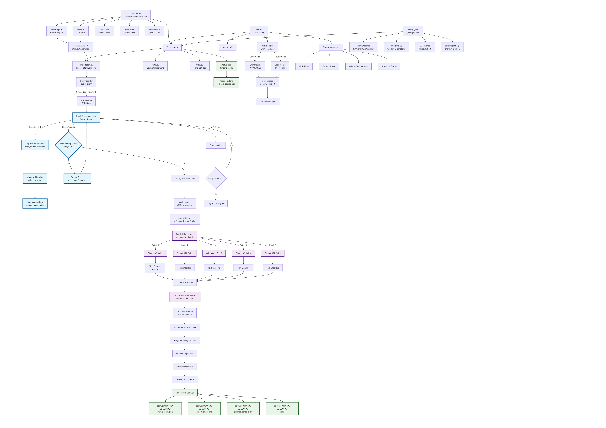

# arXivPush: 基于 Discord 的每日论文推送系统

[](README.md)
[](README_EN.md)

自动化的科研信息系统，用于每日从 arXiv 获取最新论文并生成中英学术日报。
系统集成本地 LLM（Ollama）实现论文摘要趋势分析互动问答，通过 Discord 实时推送


---

**arXivPush** is an automated research information system that retrieves the latest papers from arXiv every day and generates bilingual (Chinese-English) academic daily reports.
 The system integrates a local LLM (Ollama) for paper summarization, trend analysis, and interactive Q&A, and pushes updates to Discord in real time.

## 部分输出示例

**ArxivPush** 系统自动生成的日报示例（由于消息过长，仅展示部分内容）。


## 快速部署指南

### 环境要求

  * Python 3.8+
  * Linux (原部署环境Ubuntu 24.04)
  * 内存 ≥ 4GB（推荐 8GB）
  * 硬盘空间 ≥ 10GB

### 外部依赖

* Ollama：本地大语言模型运行环境
* Discord Bot Token：从 Discord Developer Portal 获取
* Discord Channel ID：目标推送频道的唯一 ID


### 安装

#### 克隆与安装依赖

```
git clone <repository-url>
cd arxivpush
pip install -r requirements.txt
```

#### 安装 Ollama 并拉取模型

```
curl -fsSL https://ollama.ai/install.sh | sh
ollama pull qwen2.5:7b
ollama serve
```

> 16GB 显存推荐使用 `qwen2.5:7b`，8GB 可使用 `qwen2.5:3b`。

#### 配置 Discord 应用

1. 打开 [Discord Developer Portal](https://discord.com/developers/applications)
2. 创建应用 → 启用 Bot → 获取 Token
3. 启用 “Message Content Intent”
4. 邀请 Bot 至服务器
5. 获取频道 ID（右键频道 → Copy ID）

#### 创建 `.env`

```
DISCORD_BOT_TOKEN=your_discord_bot_token_here
```

#### 配置 `config.yaml`

```
queries:
- any:
  - machine learning
  - deep learning
- all:
  - transformer
  - attention
categories:
- cs.CV
- cs.LG
timezone: America/New_York
report_times:
- '10:00'
- '22:00'
discord_channel_id: your_channel_id_here
ollama:
  model: qwen2.5:7b
  host: http://127.0.0.1:11434
  keep_alive: 0
```

#### 启动服务

```bash
python bot.py
# 或后台运行
nohup python3 bot.py > bot_output.log 2>&1 &
```


## 运行与使用

###  Discord 命令（部分需要手动启用）

| 命令                     | 说明                |
| ------------------------ | ------------------- |
| arxiv-smi                | 查看系统状态        |
| arxiv-rn am / pm         | 立即生成早报 / 晚报 |
| arxiv-p-start            | 启动服务            |
| arxiv-p-stop             | 停止服务            |
| arxiv-p-config get / set | 查看或修改配置      |
| arxiv-p-logs [行数]      | 查看日志            |
| arxiv-help               | 查看帮助            |

### CLI 命令

```
python arxiv-cli.py start     # 启动服务
python arxiv-cli.py rn pm     # 手动生成晚报
python arxiv-cli.py smi       # 查看实时监控
```

### 对话功能

直接在 Discord 频道中输入以 `/` 开头的消息即可与最新日报对话：

```
/这些论文的研究趋势是什么？
/解释第一篇论文的主要创新点
```


## 系统架构




### 模块说明

* **bot.py**：主入口，负责消息监听、命令解析、任务调度
* **arxiv_fetch.py**：从 arXiv 拉取论文并过滤
* **summarizer.py**：调用 Ollama 模型生成摘要与趋势分析
* **text_processor.py**：格式化文本、生成 APA6 引用
* **state.py**：持久化管理，存储所有周期数据


## 算法与实现细节

### 调度算法

```python
def start_scheduler():
    if report_mode == "hourly":
        scheduler.add_job(post_digest, CronTrigger(minute=0))
    else:
        for t in report_times:
            hour, minute = map(int, t.split(":"))
            scheduler.add_job(post_digest, CronTrigger(hour=hour, minute=minute))
```

### 查询构建算法

```python
def build_query(queries, categories, exclude_keywords):
    parts = []
    for query in queries:
        if 'any' in query:
            parts.append(f"({' OR '.join(query['any'])})")
        if 'all' in query:
            parts.append(f"({' AND '.join(query['all'])})")
    if categories:
        cat = " OR ".join([f"cat:{c}" for c in categories])
        parts.append(f"({cat})")
    return " AND ".join(parts)
```

### 批处理摘要生成

```python
def run_ollama(cfg, period_label, since_str, now_str, items_json):
    for i in range(0, len(items_json), 4):
        batch = items_json[i:i+4]
        prompt = build_batch_prompt(batch, i+1)
        result = call_ollama(prompt, timeout=300)
        all_content += reconstruct_with_numbering(result, batch, i+1)
    trend = call_ollama(build_trend_prompt(all_content))
    return post_process_with_links(all_content, trend, items_json)
```

### 文本解析与APA6生成

```python
def generate_apa6_citation(paper, index):
    arxiv_id = paper['id'].split('v')[0]
    authors = ', '.join(paper['authors'][:3]) + (' et al' if len(paper['authors']) > 3 else '')
    title = paper['title']
    year = paper['published'][:4]
    link = f"https://arxiv.org/abs/{arxiv_id}"
    return f"[{index}] {authors} ({year}). {title}. arXiv ID: {arxiv_id}. {link}"
```


## 系统流程

### 1. 定时推送


### 智能对话


## 性能与优化

* **批处理机制**：防止 LLM 上下文溢出
* **内存控制**：`keep_alive=0` 自动释放显存
* **并行数据抓取**：异步请求 arXiv API
* **分段推送**：自动切分长消息，保证 Discord 可读性
* **缓存策略**：避免重复拉取与生成，提高执行效率


## 配置与扩展

* 支持多模型：`DeepSeek`、`Qwen`、`Mistral`
* 支持自定义关键词逻辑（AND / OR 混合）
* 支持多时区与多周期
* 报告模板可定制（精简版、会议追踪版、研究主题版）


## 版本更新

### v1.3.0 （2025-10-13）

### 时间感知迭代搜索架构

- 动态时间窗口扩展机制，基于当前时间倒推搜索
- 优先获取最新论文，按提交时间降序排列
- 智能去重和回退策略，确保系统稳定性
- 完全向后兼容，支持原有接口无缝集成

### Ollama 服务完整集成

[
- 完整的CLI命令支持：arxiv start/stop/restart/test/status
- 实时状态监控和智能错误处理
- 支持自定义主机地址和模型选择

### 性能优化

- 通常2-3个时间窗口即可达到20篇论文目标
- 论文时效性控制在3-7天内
- 智能去重从30+候选中精选最优论文
- 单次完整搜索时间小于30秒

### v1.2.0（2025-10-12）

* 实现智能批处理摘要生成
* 新增 APA6 引用格式模块
* 完整的趋势分析与后处理架构
* 优化 Ollama 内存管理与日志系统

### v1.1.0（2025-10-11）

* 增强 CLI 与生产环境部署
* 改进日志与状态监控模块

### v1.0.0（2025-10-10）

* 初始版本：实现每日推送、摘要生成与智能对话

---

## License / 许可协议

Creative Commons Attribution-NonCommercial 4.0 International (CC BY-NC 4.0)
知识共享署名-非商业性使用 4.0 国际许可协议
https://creativecommons.org/licenses/by-nc/4.0/

© 2025 Steven ZN

---

This project is licensed under the Creative Commons Attribution-NonCommercial 4.0 International License (CC BY-NC 4.0).
You are free to share and adapt this work for research and educational purposes only, under the following terms:

本项目依据 知识共享署名-非商业性使用 4.0 国际许可协议 (CC BY-NC 4.0) 授权。
您可以在 科研与教育用途 下自由共享与修改本作品，但须遵守以下条款：
	•	Attribution / 署名 — You must give appropriate credit and provide a link to this license.
您必须在引用或使用时明确署名并附上许可协议链接。
	•	NonCommercial / 非商业性使用 — You may not use the material for commercial purposes.
您不得将本项目用于任何商业或营利性目的。

---

### Citation Notice / 引用声明

If you use arXivPush in academic publications, please cite as follows:
如果您在学术论文或项目中使用了 arXivPush，请引用如下：

Steven ZN. arXivPush: An Automated Research Paper Digest and Dialogue System on Discord. 2025.
https://github.com/Steven-ZN/arXivPush

---

### Restrictions / 限制声明

	•	This software and its outputs are intended for non-commercial academic and research use only.
	•	Redistribution, resale, or integration into commercial systems is strictly prohibited.

本软件及其输出结果仅限 非商业学术研究用途。
禁止任何形式的商业再分发、销售或嵌入付费系统。

---
