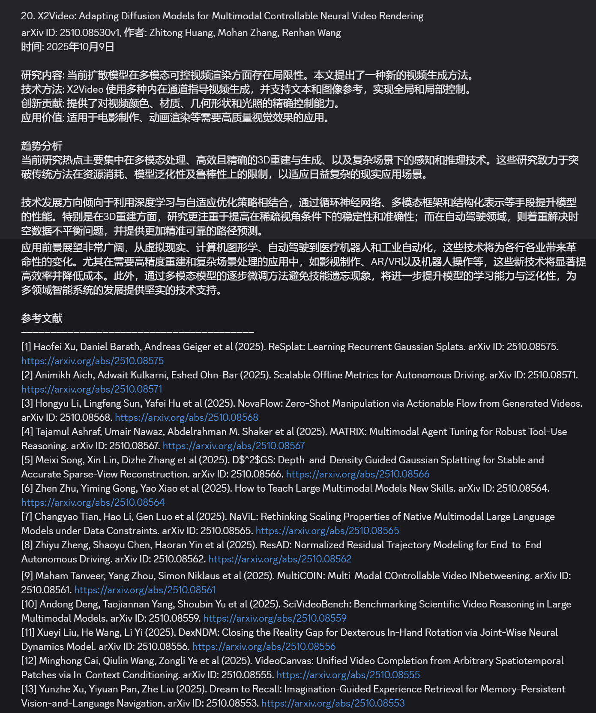
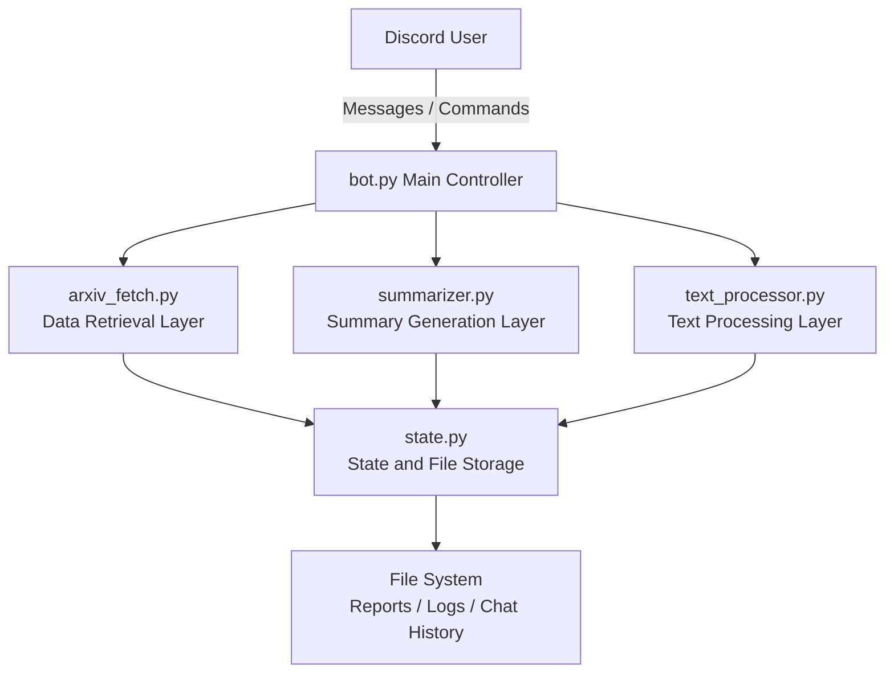
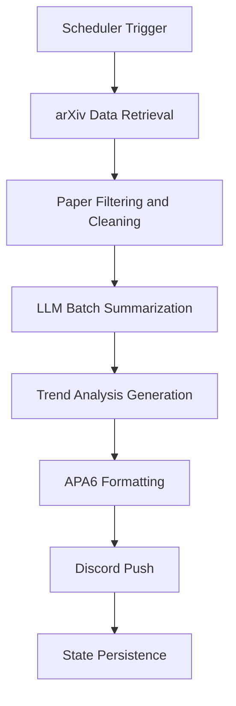
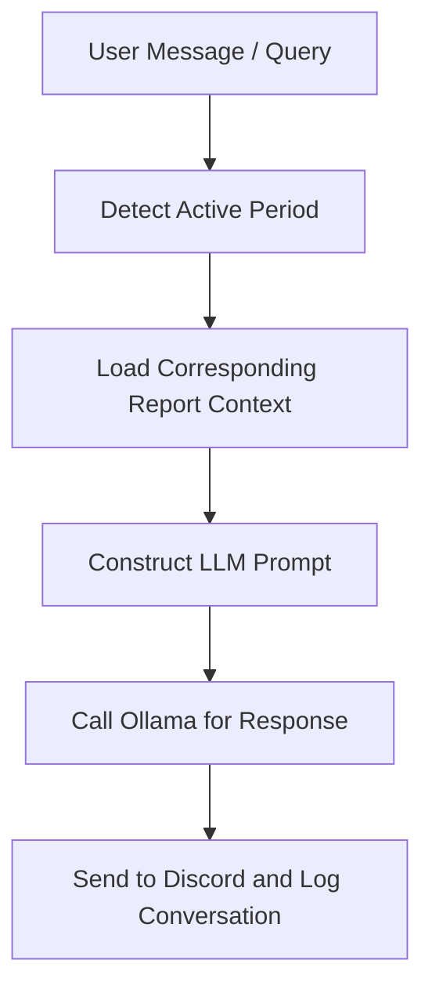

# arXivPush: Daily Paper Push System Based on Discord

**arXivPush** is an automated research information system that retrieves the latest papers from arXiv every day and generates bilingual (Chinese-English) academic daily reports.
 The system integrates a local LLM (Ollama) for paper summarization, trend analysis, and interactive Q&A, and pushes updates to Discord in real time.

------

## Example Output

An automatically generated report from the **ArxivPush** system (only a partial view is shown due to message length limits).



------

## Quick Deployment Guide

### Environment Requirements

- Python 3.8+
- Linux / macOS / Windows
- Memory ≥ 4GB (8GB recommended)
- Disk space ≥ 10GB

### External Dependencies

- **Ollama**: Local large language model runtime
- **Discord Bot Token**: Obtainable from the Discord Developer Portal
- **Discord Channel ID**: The unique ID of the target push channel

------

### Installation

#### Clone and Install Dependencies

```
git clone <repository-url>
cd arxivpush
pip install -r requirements.txt
```

#### Install Ollama and Pull Model

```
curl -fsSL https://ollama.ai/install.sh | sh
ollama pull qwen2.5:7b
ollama serve
```

> `qwen2.5:7b` is recommended for 16GB VRAM, and `qwen2.5:3b` for 8GB VRAM.

#### Configure Discord Application

1. Go to [Discord Developer Portal](https://discord.com/developers/applications)
2. Create an application → Enable Bot → Obtain Token
3. Enable “Message Content Intent”
4. Invite the Bot to your server
5. Get the Channel ID (right-click the channel → Copy ID)

#### Create `.env`

```
DISCORD_BOT_TOKEN=your_discord_bot_token_here
```

#### Configure `config.yaml`

```
queries:
- any:
  - machine learning
  - deep learning
- all:
  - transformer
  - attention
categories:
- cs.CV
- cs.LG
timezone: America/New_York
report_times:
- '10:00'
- '22:00'
discord_channel_id: your_channel_id_here
ollama:
  model: qwen2.5:7b
  host: http://127.0.0.1:11434
  keep_alive: 0
```

#### Start the Service

```bash
python bot.py
# or run in background
nohup python3 bot.py > bot_output.log 2>&1 &
```

------

## Running and Usage

### Discord Commands (some require manual activation)

| Command                  | Description                                  |
| ------------------------ | -------------------------------------------- |
| arxiv-smi                | View system status                           |
| arxiv-rn am / pm         | Generate morning/evening reports immediately |
| arxiv-p-start            | Start the service                            |
| arxiv-p-stop             | Stop the service                             |
| arxiv-p-config get / set | View or modify configuration                 |
| arxiv-p-logs [lines]     | View logs                                    |
| arxiv-help               | Show help menu                               |

### CLI Commands

```
python arxiv-cli.py start     # Start the service
python arxiv-cli.py rn pm     # Manually generate the evening report
python arxiv-cli.py smi       # View real-time system monitor
```

### Interactive Q&A

Send a message starting with `/` in the Discord channel to interact with the latest report:

```
/What are the research trends in these papers?
/Explain the main innovation of the first paper.
```

------

## System Architecture



### Module Descriptions

- **bot.py**: Entry point; handles message listening, command parsing, and task scheduling
- **arxiv_fetch.py**: Retrieves and filters papers from arXiv
- **summarizer.py**: Calls Ollama model for summarization and trend analysis
- **text_processor.py**: Formats text and generates APA6 citations
- **state.py**: Persistent management, storing data for all report periods

------

## Algorithms and Implementation Details

### Scheduler Algorithm

```python
def start_scheduler():
    if report_mode == "hourly":
        scheduler.add_job(post_digest, CronTrigger(minute=0))
    else:
        for t in report_times:
            hour, minute = map(int, t.split(":"))
            scheduler.add_job(post_digest, CronTrigger(hour=hour, minute=minute))
```

### Query Construction Algorithm

```python
def build_query(queries, categories, exclude_keywords):
    parts = []
    for query in queries:
        if 'any' in query:
            parts.append(f"({' OR '.join(query['any'])})")
        if 'all' in query:
            parts.append(f"({' AND '.join(query['all'])})")
    if categories:
        cat = " OR ".join([f"cat:{c}" for c in categories])
        parts.append(f"({cat})")
    return " AND ".join(parts)
```

### Batch Summary Generation

```python
def run_ollama(cfg, period_label, since_str, now_str, items_json):
    for i in range(0, len(items_json), 4):
        batch = items_json[i:i+4]
        prompt = build_batch_prompt(batch, i+1)
        result = call_ollama(prompt, timeout=300)
        all_content += reconstruct_with_numbering(result, batch, i+1)
    trend = call_ollama(build_trend_prompt(all_content))
    return post_process_with_links(all_content, trend, items_json)
```

### Text Parsing and APA6 Citation Generation

```python
def generate_apa6_citation(paper, index):
    arxiv_id = paper['id'].split('v')[0]
    authors = ', '.join(paper['authors'][:3]) + (' et al' if len(paper['authors']) > 3 else '')
    title = paper['title']
    year = paper['published'][:4]
    link = f"https://arxiv.org/abs/{arxiv_id}"
    return f"[{index}] {authors} ({year}). {title}. arXiv ID: {arxiv_id}. {link}"
```

------

## System Workflow

### 1. Scheduled Push



### Intelligent Conversation



------

## Performance and Optimization

- **Batch Processing**: Prevents LLM context overflow
- **Memory Control**: `keep_alive=0` automatically releases VRAM
- **Parallel Data Fetching**: Asynchronous arXiv API requests
- **Segmented Push**: Splits long messages to ensure Discord readability
- **Caching Strategy**: Avoids redundant API calls, improving efficiency

------

## Configuration and Extension

- Supports multiple models: `DeepSeek`, `Qwen`, `Mistral`
- Supports complex keyword logic (AND / OR mixed)
- Supports multiple time zones and report cycles
- Customizable report templates (Concise / Conference / Topic-focused)

------

## Version Updates

### v1.2.0 (2025-10-12)

- Implemented intelligent batch summary generation
- Added APA6 citation module
- Completed trend analysis and post-processing pipeline
- Optimized Ollama memory management and logging

### v1.1.0 (2025-10-11)

- Enhanced CLI and production deployment
- Improved logging and state monitoring modules

### v1.0.0 (2025-10-10)

- Initial release: Daily push, summarization, and interactive Q&A

------

## ## License 

Creative Commons Attribution-NonCommercial 4.0 International (CC BY-NC 4.0)


© 2025 Steven ZN

---

This project is licensed under the Creative Commons Attribution-NonCommercial 4.0 International License (CC BY-NC 4.0).
You are free to share and adapt this work for research and educational purposes only, under the following terms:

	•	Attribution / 署名 — You must give appropriate credit and provide a link to this license.
 You may not use the material for commercial purposes.


---

### Citation Notice / 引用声明

If you use arXivPush in academic publications, please cite as follows:


Steven ZN. arXivPush: An Automated Research Paper Digest and Dialogue System on Discord. 2025.
https://github.com/Steven-ZN/arXivPush

---

### Restrictions 
	•	This software and its outputs are intended for non-commercial academic and research use only.
	•	Redistribution, resale, or integration into commercial systems is strictly prohibited.


